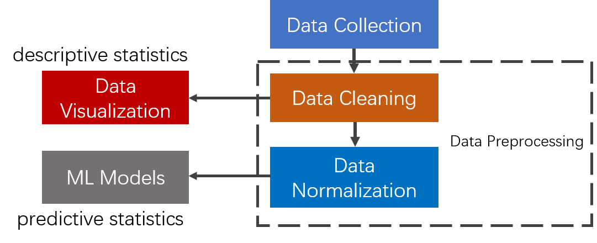
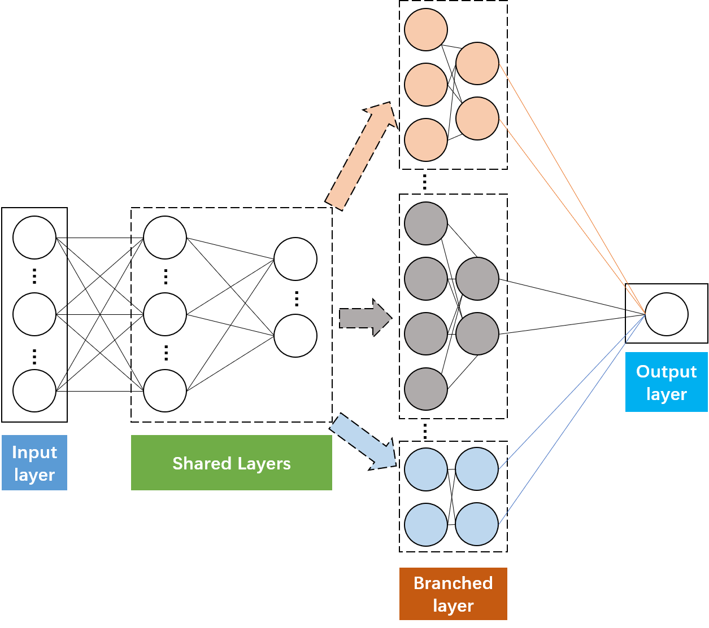

# Data-driven Approach for Quality Evaluation on Knowledge Sharing Platform

## Introduction
Knowledge sharing plays a significant role in knowledge acquisition for ordinary people,
however, due to the insufficient evaluation schemes, people suffer from lots of low-level
knowledge services, which overwhelm the platform as well.

In our paper, we propose a data-driven method to automatically predict a Zhihu Live's
score. For more details, please refer to our [paper](https://arxiv.org/abs/1903.00384).

## Methods





## Experimental Results
| Model | MAE | RMSE |   
| :---: | :---: | :---: | 
| Linear Regression | 0.2366 | 0.3229 |
| KNN Regression | 0.2401 | 0.3275 |
| SVR (RBF) | 0.2252 | 0.3270 |
| SVR (Linear) | 0.2257 | 0.3267 |
| SVR (Poly) | 0.2255 | 0.3268 |
| Random Forest Regressor | 0.2267 | 0.3244 |
| MLP | 0.2397 | 0.3276 |
| **MTNet** | **0.2250** | **0.3216** |


## Resource
* [ZhihuLiveDB](https://drive.google.com/open?id=1qIOHy5oADGfJLt5C6YHr5TxJLdND4Im2) 
* [pretrained MTNet](./analysis/model/ZhihuLive_MTNet.pth)
* [Zhihu Live Comments](https://drive.google.com/file/d/1MbezeRjCy5NUkrP2p8KzHqO66fNVANue/view?usp=sharing)

## Citation
If you find this repository, dataset or experimental results useful in your research, please cite our paper:
```
@article{xu2019data,
  title={Data-driven Approach for Quality Evaluation on Knowledge Sharing Platform},
  author={Xu, Lu and Xiang, Jinhai and Wang, Yating and Ni, Fuchuan},
  journal={arXiv preprint arXiv:1903.00384},
  year={2019}
}
``` 